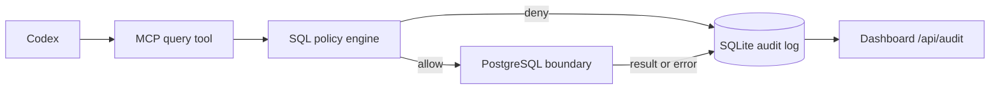

# SentiQL

SentiQL is a governed PostgreSQL MCP server for Codex. It enforces a conservative SQL policy before execution, writes every decision to a local SQLite audit log, and includes a small internal audit console.

## Prerequisites and local setup

Use Node.js 22 or newer and Docker Compose.

```sh
npm install
cp .env.example .env
docker compose up -d
npm test
npm start
```

In a separate terminal, start the audit console:

```sh
npm run dashboard
```

The dashboard is available at [http://127.0.0.1:3030](http://127.0.0.1:3030). It polls its audit feed every two seconds. On PowerShell, replace `cp` with `Copy-Item`.

`npm start` and `npm run dashboard` load `.env` when present. The supplied Compose service exposes PostgreSQL 16 at `127.0.0.1:5432` with the demonstration `sentiql` database, user, and password.

## Policy mode

`POLICY_MODE=read-only` is the default. It permits governed read queries and rejects writes, schema changes, privilege operations, stacked statements, and unsafe predicates. Set `POLICY_MODE=read-write` only when mutation is required; the policy still rejects nested writes and `UPDATE`/`DELETE` without a meaningful `WHERE` clause.



The MCP server boundary is the enforcement point: every database request sent through this MCP tool must be evaluated and audited before it can reach PostgreSQL. A Codex `PreToolUse` hook is not a substitute, because hooks do not reliably cover MCP tool calls.

Read-only mode also uses `BEGIN READ ONLY` for every database execution. In production, use a PostgreSQL credential with a read-only database role as well. The database role and transaction are defense in depth if policy parsing is bypassed or a side-effecting `SELECT` function is attempted; policy validation remains the first boundary.

## Register with Codex

Register the MCP server with absolute paths to both the environment file and server. This is important because Codex can launch MCP processes from a directory other than the project root:

```sh
codex mcp add sentiql -- node --env-file=/absolute/path/to/sentiql/.env /absolute/path/to/sentiql/src/server.mjs
```

The equivalent `config.toml` entry is:

```toml
[mcp_servers.sentiql]
command = "node"
args = ["--env-file=/absolute/path/to/sentiql/.env", "/absolute/path/to/sentiql/src/server.mjs"]
```

Replace both placeholder paths with your own absolute paths. `POSTGRES_URL` is required when the production MCP server starts.

## Environment

| Variable | Default | Purpose |
| --- | --- | --- |
| `POSTGRES_URL` | local Compose URL | PostgreSQL connection string |
| `POLICY_MODE` | `read-only` | `read-only` or explicit `read-write` policy |
| `POLICY_BUNDLE_PATH` | `./config/policy.json` | Versioned policy bundle, including the OIDC issuer and claim mappings |
| `OIDC_TOKEN_FILE` | `/run/secrets/agentconnect-oidc-token` | Host/workload-managed file containing the short-lived OIDC access token |
| `AUDIT_DB_PATH` | `./data/audit.sqlite` | Shared SQLite path; relative values resolve from the project root, not the MCP process working directory |
| `DASHBOARD_HOST` | `127.0.0.1` | Dashboard bind host |
| `DASHBOARD_PORT` | `3030` | Dashboard port |

## Workload identity

Production requests are authenticated with an OIDC workload token supplied by the MCP host or workload platform through `OIDC_TOKEN_FILE`. SentiQL reads and trims the file for each request, verifies its signature against the HTTPS issuer/JWKS configuration in the policy bundle, and checks issuer, audience, expiry, issued-at, subject, organization, tenant, and roles claims. The resulting principal is immutable.

The token file is host-managed and must be readable by the SentiQL process, contain one current token, and be rotated before its short lifetime expires. Missing, empty, malformed, expired, or unverifiable tokens fail closed. Configure HTTPS issuer and JWKS endpoints in production and rotate signing keys through the issuer's normal JWKS mechanism.

Agents must not supply or override a subject, organization, tenant, role, or purpose in a request. Those values come from the verified token and policy bundle; request inputs are authorization data only, never caller-supplied identity.
